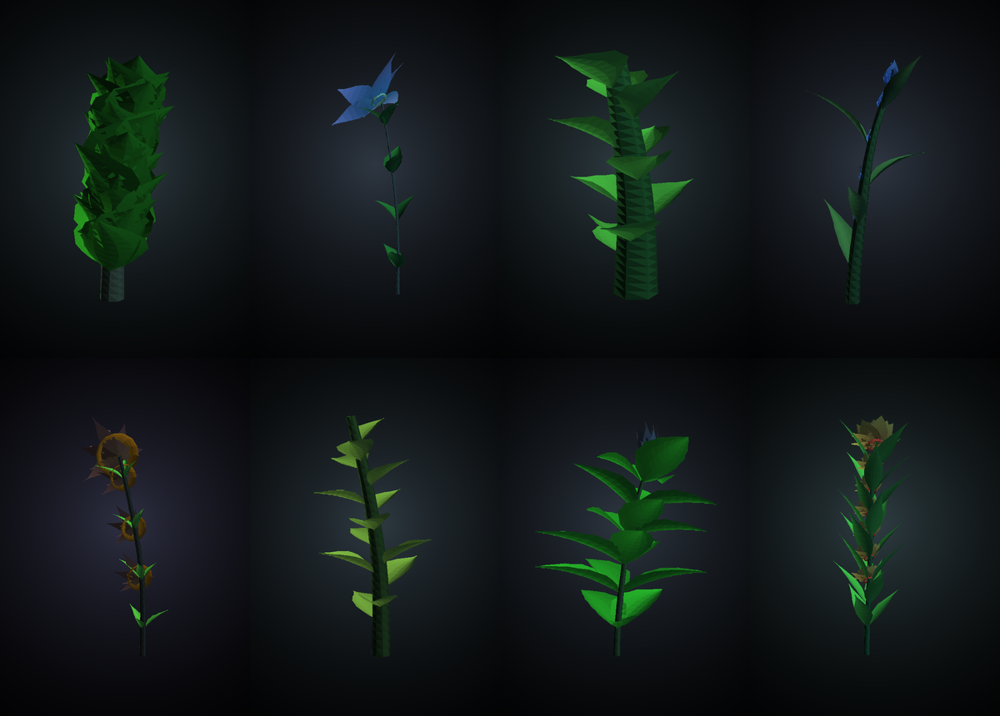
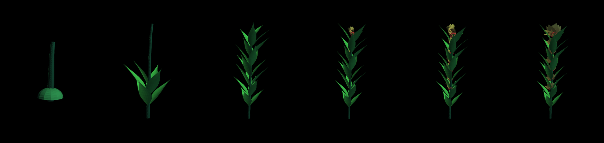
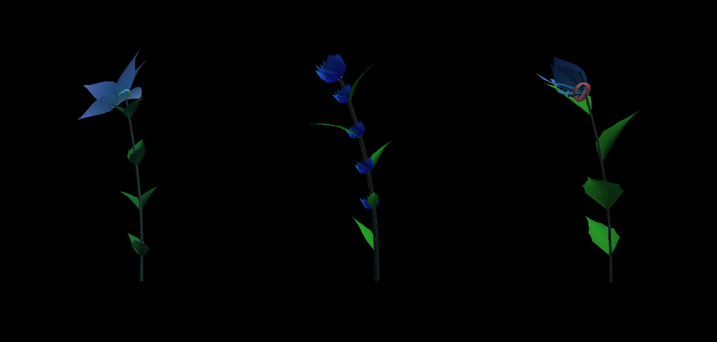

# Peace Garden

[](https://github.com/marcusbsorensen/peace-garden/actions/workflows/tests.yml)

An iPhone and iPad app in which a plant is grown from a seed drawn once, on one
device, for one person — and where two people who meet in person can cross their seeds
by touching their phones together, growing a plant that neither could have grown
alone.

The plant is the only thing on screen. It stands in a soft pool of cool light
on black — the way a botanical model kit is photographed for its box — in full
colour and full focus, turned with a finger, with controls that appear when you
tap and see themselves out again.

Picking this up cold? Start with [docs/HANDOVER.md](docs/HANDOVER.md).

**This is phase 1: the seed, and the meeting.** The shared peace garden with
other people's plots and guest books is phase 2, sketched in
[docs/PHASES.md](docs/PHASES.md).

## What works

- **A seed of your own.** Minted once from 32 random bytes plus what the phone
  can see of the moment — model, locale, timezone, uptime, the instant itself —
  hashed into 32 bytes that never change and never leave the phone unless you
  meet someone.
- **A plant derived entirely from that seed.** Twelve archetypes (spire, umbel,
  fern, orchid, lotus, thistle, vine, bell, star, poppy, succulent, plume),
  around eighty inherited traits, procedural geometry, and a binomial name.
- **Colour with a reason behind it.** Six harmony schemes — monochrome,
  analogous, complementary, split, bicolour, ombré — decide how a flower's two
  colours relate, rather than drawing both at random and hoping. Flowers mostly
  skip the green that leaves wear, so they read as flowers.
- **Markings and foliage.** Throats, veining, and the occasional contrasting
  picotee rim. Foliage in green, olive, burgundy, plum, silver or bronze, plain
  or margined or striped or speckled. Toothed leaf margins, ribbed blades,
  cleft petal tips, sepals under the flower and a pistil at its centre.
- **A stage, not a void.** Black ground, a soft radial glow behind the plant
  falling away to nothing at the edges, tinted a few percent toward the plant's
  own colour so each person's stage is quietly theirs.
- **Real-time growth.** Germinating, seedling, growing, in bud, in bloom,
  mature, over days — plus a day/night rhythm, so a flower that opens by day is
  closed at two in the morning.
- **Meeting someone.** Both open Meet, tap the tops of the phones together, and
  both phones independently derive the same hybrid and prove it to each other
  before either one shows it.
- **Keeping it.** The hybrid, with the date and time if you want them, a place,
  and a line about the meeting. Then it grows, from the moment you met.
- **Seeds on the wind.** If the other person doesn't have the app, your phone
  can still hand them a seed — as a code held up to their camera, or an AirDrop,
  or a message. It takes root where it lands: their phone draws a seed of its
  own and crosses it with yours. A reply code brings it back so you both end up
  with the same plant. See
  [docs/SEEDS-ON-THE-WIND.md](docs/SEEDS-ON-THE-WIND.md).

## Where the tap really happens

An iPhone app cannot open an NFC link to another iPhone — Core NFC reads tags,
and the tap-to-share gestures in iOS are system features with no API. So the tap
is treated as **a gesture, not a transport**: both accelerometers feel the
knock, and the seeds cross over Multipeer Connectivity, which is already
connected by then. Nothing proceeds until both phones have felt it within three
seconds of each other.

The full reasoning, the handshake and the derivation are in
[docs/EXCHANGE-PROTOCOL.md](docs/EXCHANGE-PROTOCOL.md).

The same constraint is why a phone cannot hand the *app* to a phone that lacks
it — but it can hand over the seed, and an App Clip can grow it without the
receiver ever opening the App Store. That is
[docs/SEEDS-ON-THE-WIND.md](docs/SEEDS-ON-THE-WIND.md).

## Building it

```sh
brew install xcodegen
git clone git@github.com:marcusbsorensen/peace-garden.git
cd peace-garden
xcodegen generate
open PeaceGarden.xcodeproj
```

Set your team under Signing & Capabilities, then run. `.xcodeproj` is generated
rather than checked in — it is the worst file in an iOS repository to merge.

**You need two physical devices.** The Simulator has no accelerometer to feel
the tap and no radio for Multipeer, so the exchange can only be exercised on
hardware — any mix of iPhone and iPad. Everything else — minting, growth,
rendering, the garden — runs in the Simulator.

Universal, and not by stretching a phone layout: the plant is re-framed to the
shape of the viewport, so it fills the same proportion of the screen on a phone
held upright, an iPad turned sideways, or a narrow Split View column. Text is
held to a readable measure rather than run the width of an iPad.

Requires iOS/iPadOS 17 (SwiftUI `@Observable`), Xcode 15 or later. Portrait on
iPhone; any orientation on iPad, which is also what allows Split View.

### Running the tests

```sh
swift test --package-path Packages/SeedCore
```

Runs on macOS or Linux, and on every push through
[`.github/workflows/tests.yml`](.github/workflows/tests.yml). Or open the
package in Xcode and test the `SeedCore` scheme. The tests cover the
parts that are expensive to get wrong: the derivation vectors, commutativity of
the cross, trait ranges across hundreds of genomes, growth monotonicity, and
120 genomes × 7 ages of generated geometry checked for non-finite vertices and
out-of-range indices.

```sh
python3 tools/reference/derivation_reference.py
```

prints the same vectors from an independent implementation of the spec in
another language. If the Swift tests and this file ever disagree, one of them
has drifted.

### Seeing plants without a Mac

`tools/preview/` is a Python port of the genome, the growth model and the
geometry, with a rough renderer, so the plants can be looked at before there is
a device to look at them on:

```sh
cd tools/preview
pip install numpy pillow
python3 preview.py --seeds 12 --out sheet.png        # twelve plants in bloom
python3 preview.py --seed hello --stages --out row.png   # one plant over its life
python3 preview.py --cross ada marcus --out cross.png    # two parents and their child
```

It is a sketch, not a second source of truth — `SeedCore` is authoritative, and
the port will drift the moment the Swift changes. It earns its place by being
runnable anywhere.

Eight plants in bloom:



One plant from seed husk to open flower:



Two parents, and the plant their meeting made — the child takes its form and
pale blue from one, its depth of colour and broader leaves from the other, and
its name from both:



### Status, honestly

**SeedCore compiles and its 52 tests pass on macOS and on Linux.** On Apple's
platforms it builds against CryptoKit and `simd`; off them, against swift-crypto
and the small compatibility layer in `Sources/SeedCore/Compatibility/`, which is
what lets CI run the whole suite on every push. Both paths give identical
results — so the compatibility layer is demonstrably equivalent to Apple's
`simd`, rotations included, rather than merely close. That covers the derivation, the genome, growth, the geometry, the
colour model, seed links and persistence.

**The 17 files in `App/` have never been compiled.** SwiftUI, SceneKit and UIKit
need the macOS SDK, so Xcode is the only place they build. Expect to fix errors
there on first open.

What has actually been executed, rather than believed:

- **The derivation.** `tools/reference/derivation_reference.py` implements the
  spec independently and was run; its outputs are pinned into the Swift tests.
  Commutativity, distinctness across 256 meetings between the same pair, and the
  36/36/22/6 inheritance mix are all measured, not assumed.
- **The geometry.** The Python port above was run over 120 genomes at seven ages
  each and checked for the same properties the Swift tests assert: no non-finite
  vertices, unit-length normals, in-range indices, and a triangle count that
  stays inside budget (the worst case is 42k against a 120k ceiling). Rendering
  those found three real defects, all since fixed: flowers were specks against
  the foliage, seedlings had full-thickness stems and full-size leaves, and the
  seed husk vanished in a single frame instead of shrinking away.

- **The whole of SeedCore**, by a Swift compiler and its own test suite. One
  function is the exception: `GrowthModel.State.summary()` uses
  `DateComponentsFormatter`, which swift-corelibs-foundation does not have, so
  it compiles only on Apple's platforms.

What has *not* been seen is the SceneKit rendering — the lighting rig, the
materials, the bloom. The one thing to check first there: if a petal's tip
colour appears at its base, flip the row order in
`GradientTexture.image(for:palette:)`, where the comment says so.

## Layout

```
.
├── Packages/SeedCore/          Pure Swift. Plants, not pixels.
│   ├── Sources/SeedCore/
│   │   ├── Compatibility/      simd, where Apple's simd is not
│   │   ├── Determinism/        Hashing, seeds, deterministic noise
│   │   ├── Genome/             Minting, traits, archetypes, names, crossing
│   │   ├── Growth/             Time to appearance
│   │   ├── Morphology/         Skeleton, surfaces, mesh, colour
│   │   ├── Exchange/           Wire format
│   │   └── Persistence/        The garden file
│   └── Tests/SeedCoreTests/
├── App/PeaceGarden/            SwiftUI + SceneKit
│   ├── Rendering/              Mesh to SceneKit, lighting, thumbnails
│   ├── Exchange/               Multipeer, touch detection, state machine
│   └── Views/
├── docs/
│   ├── HANDOVER.md             State, open items, and what not to relitigate
│   ├── ARCHITECTURE.md         Why a plant is a seed plus a birthday
│   ├── EXCHANGE-PROTOCOL.md    The handshake, and why not NFC
│   ├── SEEDS-ON-THE-WIND.md    Passing a seed to a phone without the app
│   ├── PHASES.md               What phase 2 has to answer
│   └── images/                 Previews rendered by tools/preview
├── Server/                     What peacegarden.app has to serve
│   └── .well-known/            apple-app-site-association
├── tools/
│   ├── reference/              Executable spec for the derivation
│   └── preview/                Python port + renderer, to see plants anywhere
└── project.yml                 XcodeGen
```

## The one idea

A plant is a seed plus a birthday. Everything else — shape, colour, name, pace,
geometry — is derived. Nothing about a plant's appearance is stored, sent or
synced, which is why two phones can agree on a hybrid without a server, why a
garden of a hundred plants is a few kilobytes, and why a saved plant can never
drift from the plant it draws.

It also means the derivation can never casually change. Hence the versioned
domain tags, the traits drawn by name rather than by position, and the reference
implementation. See [docs/ARCHITECTURE.md](docs/ARCHITECTURE.md).
